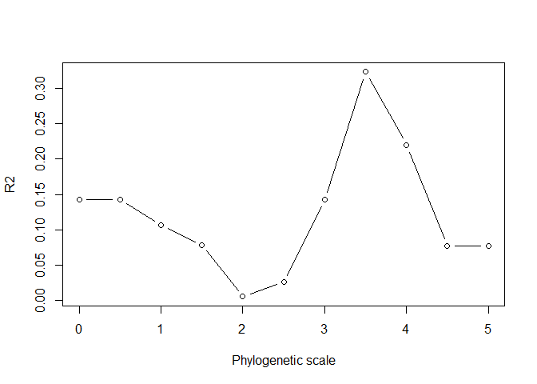

# BDTT
Your friendly reviewer  
December 5, 2016  

# Beta Diversity Trought Time (BDTT) analysis #####

In this script, we provide: 

1. A general description of the analysis
2. Examples of the use of BDTT on a dataset
  2.1 A rapid analysis, using the dataset provided in the picante package
 	2.2 A more detailed analysis, using the same dataset provided in the picante package

#General workflow of the analysis

Input DATA 
   - site * species matrix (or 'samples/hosts * unique 16S sequences' in microbiology -- The 100% similarity OTU table)
   - the species phylogeny (the names of the leaves must match those in the site*species matrix)
   - site * sites environmental distances (e.g. climatic distances, dietary or phylogenetic distances between hosts, etc). 

Computational steps (n is the total number of slices defined)
1. Create n Branch * Sites Matrices (with function 'GetBranchOcc') (or n OTU tables)
2. Compute n beta-diversity matrices (function 'GetBeta')
3. Compute the Mantel correlation profile along the phylogenetic scale, i.e. along the n slices (function 'GetCorrelations')

Output DATA : 
   - n Branch * Sites Matrices (or n OTU tables)
   - n beta-diversity matrices 
   - a correlation profile along the phylogenetic scale

NOTE 1 .  Results are successively saved in the specified output directory, and are not created in the R env.  (to avoid memory problems when a lot of slices are defined and/or when big site * species matrices are used)

NOTE 2 . Instead of using 'lapply' as in the following examples, one can use 'mclapply' to parrallelize the computations

#Examples to test the analysis


```r
# Libraries
library(picante) #loaded to use the example dataset
library(ape) # to get the Branch * sites matrices
library(abind)
library(caper) # to get the Branch * sites matrices
library(betapart) # to compute Beta-Diversity matrices
library(ecodist) # to compute correlations profiles (function 'MRM')
library(bigmemory)
library(knitr)

source("BDTT_functions.R") #load all associated functions, used to run BDTT

# Examples
data(phylocom)
TreeExmple=phylocom$phylo
SiteSpExmple=phylocom$sample
Env=rnorm(n=dim(SiteSpExmple)[1],mean=0) #random environment
names(Env)=rownames(SiteSpExmple)
ENvdi=as.matrix(dist(Env))
```

## Rapid test            

NOTE: In the following, replace '~/yourPath/' with your own path to your appropriate directory.


```r
slices=seq(from=0,to=5, by=0.5) # first, time slices are defined

a<-lapply(slices,GetBranchOcc,tree=TreeExmple,sitesp=SiteSpExmple,pathtoSaveBranchOcc="",bigmatrix=F)
a<-lapply(slices,GetBetaDiv,pathtoGetBranchOcc="",pathtoSaveBeta="")
Cors=sapply(slices,GetCorrelations,indice="sor",EnvDist=ENvdi,pathtoGetBeta="",TypeofMantel="Spearman",nperm=1000)
colnames(Cors)=slices
```

Finally, we can use a simple plot to represent the results:


```r
plot(slices,Cors[1,],type='b',xlab='Phylogenetic scale',ylab='R2')
```

<!-- -->

I left the rest for you to do, if desired. Set eval=T.


```r
#-------------------------------------#
#     2.2    Detailed test            #
#-------------------------------------#

# A. Get Branch*Sites Matrices
#--------------------------------#

# FUNCTION 'GetBranchOcc': computes a Branch*Sites matrix and directly save it in a file (not in Renv)
 
# INPUT VARIABLES
  #   slice: the age of the desired slice
  #   tree: the community phylogenetic tree (must be ultrametric)
  #   sitesp: the site * species matrix, column names must match to the leaf names of the phylogenetic tree (In microbiology, it represents the OTU table with 100% similarity OTUs)
  #   pathtoSaveBranchOcc: directory where the Branch*sites matrices are saved
  #   bigmatrix=F: if site*species is a VERY big matrix, it is highly recommended to set bigmatrix=T (use of the bigmemory package)

# OUTPUT
  # save a branch*site matrix (or OTU table) in 'pathtoSaveBranchOcc'


# For a given slice  
GetBranchOcc(slice=1,tree=TreeExmple,sitesp=SiteSpExmple,pathtoSaveBranchOcc="~/yourPath/testBDTT/branchSitesMatrices/",bigmatrix=F)
# To get the full vector of slices
lapply(seq(from=0,to=5, by=0.5),GetBranchOcc,tree=TreeExmple,sitesp=SiteSpExmple,pathtoSaveBranchOcc="~/yourPath/testBDTT/branchSitesMatrices/",bigmatrix=F)

# B. Get Beta Diversity matrices along all slices
#---------------------------------------------------#

# FUNCTION 'GetBetaDiv': computes Beta-diversities from a site*species matrix and directly saves the matrix of beta-diversities

# INPUT VARIABLES
#   slice: the age of the desired slice
#   pathtoGetBranchOcc: the input file where the branch*sites matrix is saved (result of the function GetBranchOcc)
#   pathtoSaveBeta: the output file where the matrices of beta diversities are saved (several beta-diversity metrics are used)
#   bigmatrix=F: if you used bigmatrix=T to create the branch*sites matrix with 'GetBranchOcc' (OTU table), use bigmatrix=T again.

# OUTPUT
# save Beta diversity matrices as a 3D array in 'pathtoSaveBeta' 
# Array = array of sites*sites*beta diversity metrics 

#all beta diversity metrics:

#"jtu": True Turnover component of Jaccard (Presence/Absence)
#"jne": Nestedness component of Jaccard (Presence/Absence)
#"jac": Jaccard (Presence/Absence)
#"stu": True Turnover component of Sorensen (Presence/Absence)
#"sne": Nestedness component of Sorensen (Presence/Absence)
#"sor": Sorensen (Presence/Absence)
#"bctu": True Turnover component of Bray-Curtis (Abundance version of Sorensen)
#"bcne": Nestedness component of Bray-Curtis (Abundance version of Sorensen)
#"bc": Bray-Curtis (Abundance version of Sorensen)


# For one given slice  
GetBetaDiv(slice=1,pathtoGetBranchOcc="~/yourPath/testBDTT/branchSitesMatrices/",pathtoSaveBeta="~/yourPath/testBDTT/Beta/")
# To get the full vector of slices
slices=seq(from=0,to=5, by=0.5)
lapply(slices,GetBetaDiv,pathtoGetBranchOcc="~/yourPath/testBDTT/branchSitesMatrices/",pathtoSaveBeta="~/yourPath/testBDTT/Beta/")

# Example 
# load("~/yourPath/testBDTT/Beta/BetaDiv_BetaDivSliceNo5.rdata")
# dimnames(Betaa)

# C. Get the correlation profile
#----------------------------------#

# FUNCTION 'GetCorrelations': computes correlations between beta-diversities and environmental distances at the desired slice

# INPUT VARIABLES
#   slice: the age of the desired slice
#   indice: the betadiv metric you want:
#		"jtu": True Turnover component of Jaccard (Presence/Absence)
#		"jne": Nestedness component of Jaccard (Presence/Absence)
#		"jac": Jaccard (Presence/Absence)
#		"stu": True Turnover component of Sorensen (Presence/Absence)
#		"sne": Nestedness component of Sorensen (Presence/Absence)
#		"sor": Sorensen (Presence/Absence)
#		"bctu": True Turnover component of Bray-Curtis (Abundance version of Sorensen)
#		"bcne": Nestedness component of Bray-Curtis (Abundance version of Sorensen)
#		"bc": Bray-Curtis (Abundance version of Sorensen)
#   pathtoGetBeta : the file where Beta-Diversity matrices were previously stored (output of the 'GetBetaDiv' function)
#   EnvDist: matrix of environmental distances. (e.g. geographic or climatic distances between sites, dietary or phylogenetic distances between hosts, etc).
#   TypeofMantel: type of correlation used to run the Mantel test (either "Spearman" or "Pearson")
#   nperm: number of permutations to perform to compute a p-value

# OUTPUT
# A 2*n matrix with R2 coefficients and their associated p-values

# For one given slice  
GetCorrelations(slice=1,indice="sor",EnvDist=ENvdi,pathtoGetBeta="~/yourPath/testBDTT/Correlations/",TypeofMantel="Spearman",nperm=1000)
# To get the full vector of slices
slices=seq(from=0,to=5, by=0.5)
Cors=sapply(slices,GetCorrelations,indice="sor",EnvDist=ENvdi,pathtoGetBeta="~/yourPath/testBDTT/Correlations/",TypeofMantel="Spearman",nperm=1000)
colnames(Cors)=seq(from=0,to=5, by=0.5)

#Finally, we can use a simple plot to represent the results:
plot(slices,Cors[1,],type='b',xlab='Phylogenetic scale',ylab='R2')
```


